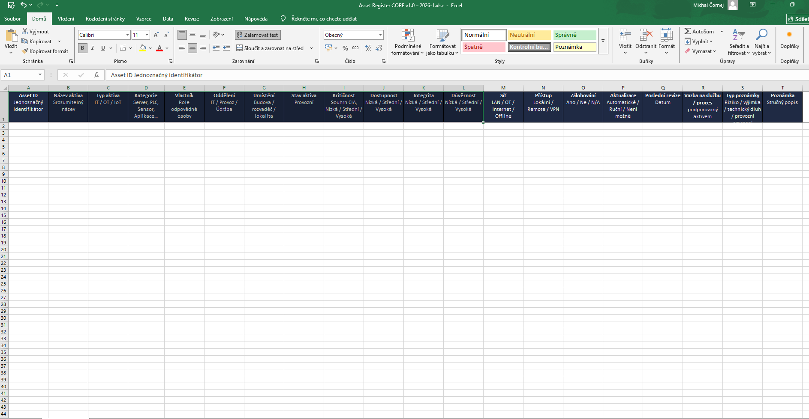
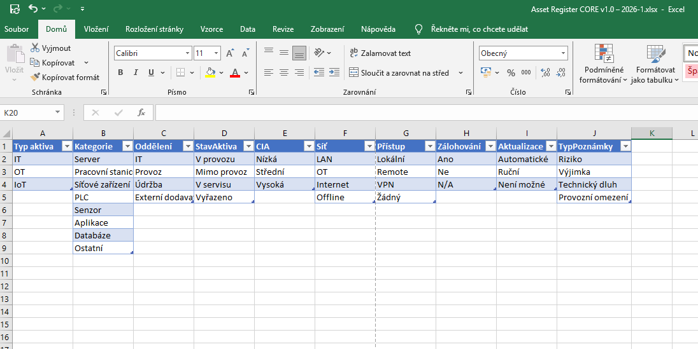
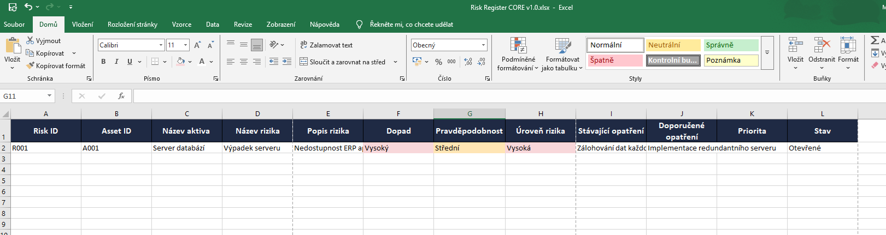

# CORE Balíček – Asset & Risk Register (Prezentační náhledy)

Tento repozitář obsahuje anonymizované náhledy **Asset a Risk Registeru** pro demonstraci struktury a principů řízení kybernetických rizik.  
**Neobsahuje citlivá data ani plnou databázi aktiv a rizik.**

## PNG náhledy

### Asset Register
-  – hlavní tabulka aktiv  
-  – přehled používaných referenčních hodnot  

### Risk Register
-  – hlavní tabulka rizik  

## PDF náhledy

### Asset Register
- [Instrukce k Asset Registeru](./pdf/asset_instrukce.pdf) – jak používat Asset Register  
- [Legenda Asset Registeru](./pdf/asset_legenda.pdf) – vysvětlení sloupců, barev a ikon  

### Risk Register
- [Instrukce k Risk Registeru](./pdf/risk_instrukce.pdf) – jak používat Risk Register  

> PDF a PNG slouží pouze k vizuální demonstraci struktury balíčku a principů řízení aktiv a rizik.
