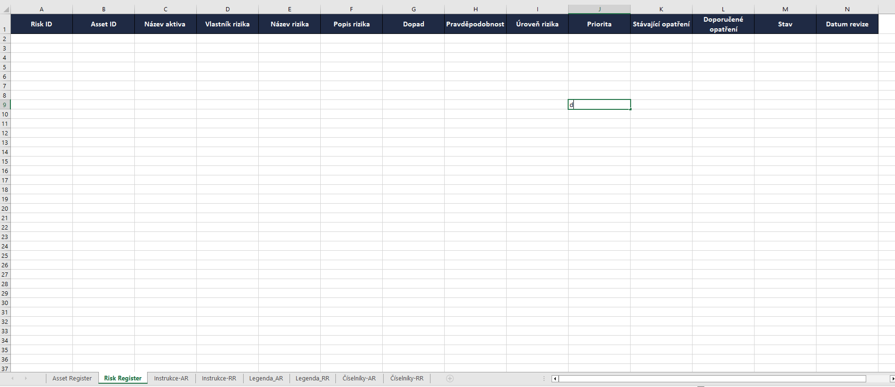

# CORE Balíček – Asset & Risk Register (Prezentační náhledy)

Tento repozitář obsahuje anonymizované náhledy Asset a Risk Registeru pro demonstraci struktury a principů řízení kybernetických rizik.
**Neobsahuje citlivá data ani plnou databázi aktiv a rizik.**

## CORE verze slouží k:
vizuální ukázce propojení aktiv a rizik,
demonstraci automatických výpočtů úrovně a priority rizika,
seznámení s číselníky a barevným značením,
prezentaci základní GRC praxe pro malé a střední organizace.

## Jak funguje propojení Asset → Risk
Asset Register eviduje všechna IT / OT / IoT aktiva: servery, PLC, senzory, aplikace atd.
Risk Register eviduje rizika spojená s jednotlivými aktivy. Každé riziko je přiřazeno k Asset ID, aby bylo jasné, které aktivum je ohroženo.

## Úroveň rizika
Úroveň rizika se počítá automaticky na základě:
Dopad (Impact) – jak vážný by byl dopad incidentu
Pravděpodobnost (Likelihood) – jak často může riziko nastat

## Princip výpočtu:
```Úroveň rizika = INDEX(_RiskMatrix; dopad; pravděpodobnost)```

(RiskMatrix je skrytá tabulka v souboru, která definuje matici dopad × pravděpodobnost → úroveň rizika)

## Priorita rizika
Priorita se vypočítá kombinací úrovně rizika a kritičnosti aktiva (CIA – Dostupnost, Integrita, Důvěrnost).

## Konzistence dat
Dropdown seznamy pro Asset ID a číselníky zajišťují konzistenci a minimalizují chyby při zadávání.

## PNG náhledy

### Asset Register
-  – hlavní tabulka aktiv  
-  – přehled používaných referenčních hodnot  

### Risk Register
-  – hlavní tabulka rizik  

## PDF náhledy

### Asset Register
- [Instrukce k Asset Registeru](./pdf/asset_instrukce.pdf) – jak používat Asset Register  
- [Legenda Asset Registeru](./pdf/asset_legenda.pdf) – vysvětlení sloupců, barev a ikon  

### Risk Register
- [Instrukce k Risk Registeru](./pdf/risk_instrukce.pdf) – jak používat Risk Register
- [Legenda Risk Registeru](./pdf/risk_legenda.pdf) – vysvětlení sloupců, barev a ikon  


## Výhody CORE verze

Přehledná, ready-to-use struktura pro demo nebo portfolio
Vizualizace úrovně a priority rizik pro rychlou orientaci
Ukázka propojení aktiv s riziky, vhodná pro pohovor nebo interní prezentaci
Nepotřebuje složité propojení přes Power Query či externí systémy

## Doporučení pro CORE verzi
PDF a PNG náhledy neobsahují citlivé informace a slouží jen k vizuální orientaci
CORE verze je určena pro prezentaci struktury a principů, nikoli pro plnou produkční evidenci
Pro reálné použití doporučeno:
pravidelná aktualizace Asset a Risk Registeru
používání číselníků a dropdown seznamů
sledování poslední revize aktiv a rizik
